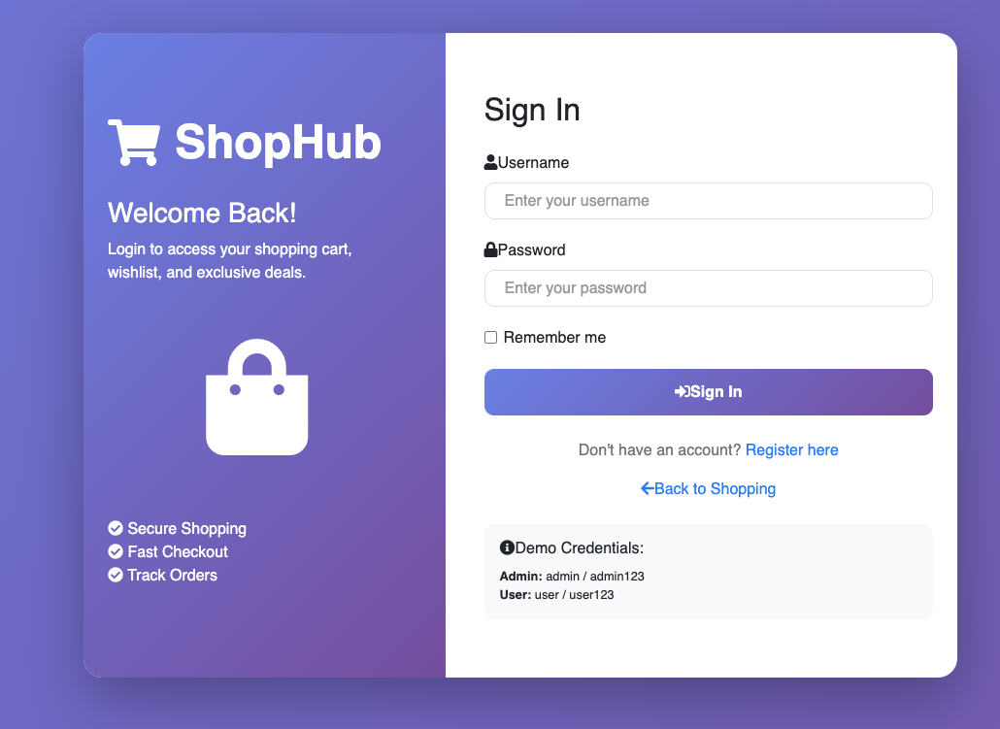
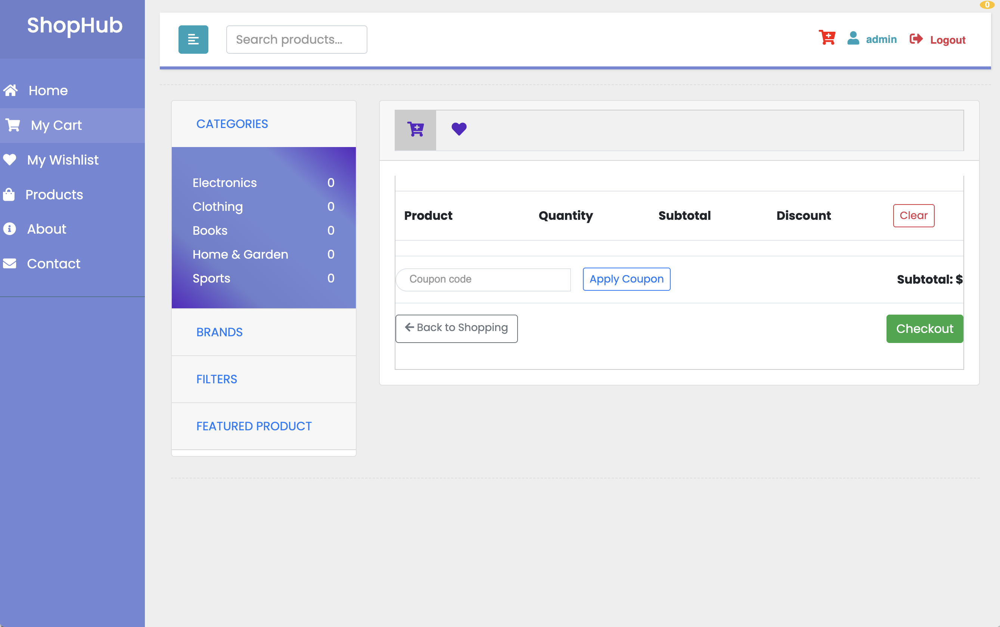

# Spring Boot E-commerce Application

A modern e-commerce web application built with Spring Boot, offering a complete online shopping experience with product
catalog, shopping cart, and wishlist functionality.

## Image Screenshots

Login Page



Checkout Page



## Features

- **Product Management**: Browse and search products by categories and brands
- **Shopping Cart**: Add products to cart, update quantities, and checkout
- **Wishlist**: Save products for later purchase
- **User Sessions**: Track user activities using session tokens
- **Responsive UI**: Built with Thymeleaf templates for a seamless shopping experience
- **Admin Dashboard**: Manage products, categories, and orders
- **Image Management**: Upload and display product images
- **Featured Products**: Highlight products with discounts

## Technologies Used

- **Backend**: Java 21, Spring Boot 3.5.3
- **Frontend**: Thymeleaf, HTML, CSS, JavaScript
- **Database**: MySQL 8.0
- **ORM**: Spring Data JPA, Hibernate
- **Build Tool**: Maven
- **Containerization**: Docker, Docker Compose
- **Database Admin**: PHPMyAdmin
- **Image Processing**: Thumbnailator
- **Development Tools**: Spring Boot DevTools, Lombok
- **Testing**: Testcontainers for database integration testing

## Prerequisites

- Java 21 or higher
- Maven 3.6 or higher
- Docker and Docker Compose (for containerized database)
- Git

## Setup and Installation

1. Clone the repository:
   ```bash
   git clone https://github.com/hendisantika/spring-boot-ecommerce.git
   cd spring-boot-ecommerce
   ```

2. Start the MySQL database using Docker Compose:
   ```bash
   docker-compose up -d
   ```

3. Build and run the application:
   ```bash
   ./mvnw spring-boot:run
   ```

4. Access the application at http://localhost:8080

5. Access PHPMyAdmin at http://localhost:8082 (username: yu71, password: 53cret)

## Database Configuration

The application is configured to connect to a MySQL database with the following settings:

- **URL**: jdbc:mysql://localhost:3308/shopDB
- **Username**: yu71
- **Password**: 53cret

These settings can be modified in the `application.properties` file.

## Project Structure

- `src/main/java/com/hendisantika/controller`: Contains all the controllers
- `src/main/java/com/hendisantika/model`: Contains all the entity models
- `src/main/java/com/hendisantika/repository`: Contains all the JPA repositories
- `src/main/java/com/hendisantika/service`: Contains all the business logic
- `src/main/resources/templates`: Contains Thymeleaf templates
- `src/main/resources/static`: Contains static resources (CSS, JS, images)

## Contributing

1. Fork the repository
2. Create your feature branch (`git checkout -b feature/amazing-feature`)
3. Commit your changes (`git commit -m 'Add some amazing feature'`)
4. Push to the branch (`git push origin feature/amazing-feature`)
5. Open a Pull Request

## License

This project is licensed under the MIT License - see the LICENSE file for details.

## Author

- **Hendi Santika** - [hendisantika@gmail.com](mailto:hendisantika@gmail.com)
- Telegram: @hendisantika34

## Acknowledgments

- Spring Boot team for the amazing framework
- All contributors who have helped with the project